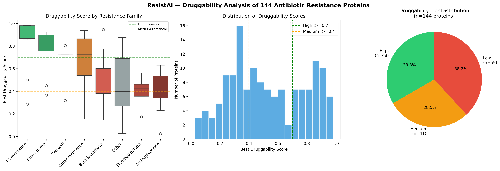
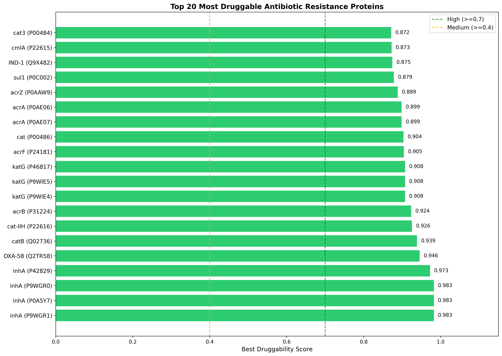
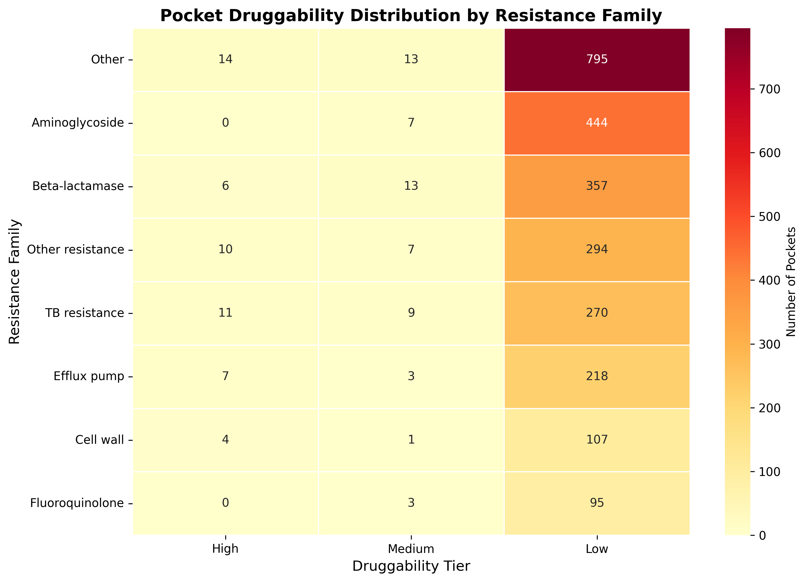
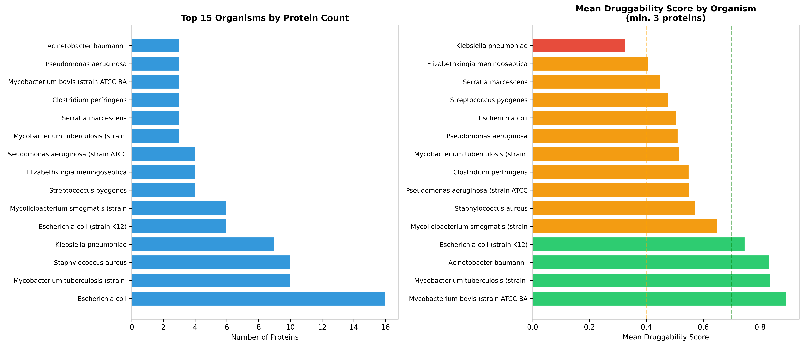

# ResistAI: An Integrated Computational Platform for Druggability Analysis of Antibiotic Resistance Proteins Using Structural Prediction and Generative AI

## Abstract

Antibiotic resistance represents one of the most critical global health threats, with the World Health Organization projecting 10 million annual deaths by 2050. Identifying druggable protein targets in resistant pathogens is a key bottleneck in antimicrobial drug discovery. Here we present ResistAI, an end-to-end open-source computational platform that integrates protein structure prediction, binding pocket detection, large-scale literature mining, and generative AI to systematically analyse druggability across WHO priority resistance proteins. ResistAI combines ESMFold and AlphaFold DB for structure prediction, fpocket for binding pocket detection and druggability scoring, and a retrieval-augmented generation (RAG) system powered by Llama 3.3 70B to enable natural language queries against 2,508 indexed PubMed articles. Applied to 144 proteins spanning eight resistance families, ResistAI identified 48 high-druggability targets (score >= 0.7), with TB resistance proteins (mean score: 0.829) and efflux pumps (mean score: 0.769) showing significantly higher druggability than aminoglycoside-modifying enzymes (mean score: 0.392; one-way ANOVA, F=7.099, p<0.0001). ResistAI is freely available at https://github.com/kagansaglam/resistai and is fully reproducible via a single setup script.

---

## 1. Introduction

The rapid emergence and global spread of antibiotic-resistant pathogens constitutes an urgent public health crisis. The ESKAPE pathogens (Enterococcus faecium, Staphylococcus aureus, Klebsiella pneumoniae, Acinetobacter baumannii, Pseudomonas aeruginosa, and Enterobacter species) are responsible for the majority of nosocomial infections worldwide and exhibit resistance to virtually all available antibiotics (1). Despite this, the antibiotic drug discovery pipeline remains critically underpopulated, partly due to the challenge of identifying tractable protein targets among the diverse repertoire of resistance mechanisms.

Computational approaches have increasingly been applied to prioritise drug targets in resistant organisms. Protein structure prediction tools, particularly AlphaFold2 (2) and ESMFold (3), have transformed structural biology by enabling high-accuracy structure prediction at proteome scale. Binding pocket detection algorithms such as fpocket (4) provide quantitative druggability scores that can guide target selection. However, these tools have not been systematically integrated with literature mining and AI-powered research assistance for antibiotic resistance applications.

Recent advances in large language models (LLMs) and retrieval-augmented generation (RAG) have opened new possibilities for scientific question-answering grounded in primary literature (5). These approaches can help researchers rapidly synthesise evidence across thousands of publications, accelerating the target identification and validation process.

Here we present ResistAI, a modular open-source platform that addresses this gap by providing: (i) an automated Nextflow DSL2 pipeline for protein structure prediction and druggability analysis; (ii) a PostgreSQL-backed results database with GFF3 export; (iii) a RAG-powered research assistant grounded in 2,508 PubMed articles; and (iv) an interactive multi-page Streamlit application for visualisation and exploration.

---

## 2. Methods

### 2.1 Protein Dataset

A curated dataset of 150 antibiotic resistance proteins was assembled from UniProt (6), spanning eight resistance families: beta-lactamases, efflux pumps, cell wall modification enzymes, aminoglycoside-modifying enzymes, TB resistance proteins, fluoroquinolone resistance proteins, and other resistance mechanisms. Proteins were selected based on WHO priority pathogen designations and clinical relevance. UniProt accession numbers, gene names, and organism annotations were retrieved via the UniProt REST API (reviewed entries only). After quality filtering (removal of placeholder structures and entries lacking binding pocket predictions), 144 proteins were retained for analysis.

### 2.2 Protein Structure Prediction

Protein sequences were retrieved in FASTA format from the UniProt REST API. Structure prediction followed a two-tier approach: (i) pre-computed structures were downloaded from the AlphaFold Protein Structure Database (7) where available (model version 4); (ii) for proteins absent from the AlphaFold DB, structures were predicted using the ESMFold API (Meta AI) (3). Sequences exceeding 400 amino acids not present in the AlphaFold DB were truncated to the N-terminal 400 residues, which typically encompasses the catalytic domain. All structures were stored in PDB format.

### 2.3 Binding Pocket Detection and Druggability Scoring

Binding pockets were identified using fpocket v4.0 (4), which employs Voronoi tessellation and alpha-sphere clustering to detect cavities on protein surfaces. Default parameters were used (minimum alpha-sphere radius: 3.4 Å, maximum: 6.2 Å, minimum spheres per pocket: 15). For each protein, all detected pockets were retained and annotated with druggability score, volume (ų), hydrophobicity score, and polarity score. Pockets were classified into three druggability tiers: high (score >= 0.7), medium (0.4 <= score < 0.7), and low (score < 0.4). The highest-scoring pocket per protein was designated the best druggable pocket.

### 2.4 Pipeline Implementation

The structural analysis pipeline was implemented using Nextflow DSL2 (8), comprising four processes: FETCH_CARD (sequence retrieval), RUN_ESMFOLD (structure prediction), FIND_POCKETS (binding pocket detection), and SUMMARY_REPORT (result aggregation). The pipeline supports local, Docker, SLURM, and LSF execution profiles, enabling deployment on both local workstations and HPC clusters. Results were persisted to a PostgreSQL relational database. Protein annotations were exported in GFF3 format with EMBL cross-references for interoperability with genome annotation tools.

### 2.5 Literature Mining and RAG System

A corpus of 2,508 PubMed abstracts was assembled using 57 targeted queries covering all major resistance mechanisms, submitted to the PubMed E-utilities API. Semantic embeddings were generated using the all-MiniLM-L6-v2 sentence transformer model (9) and indexed in a ChromaDB persistent vector database. A retrieval-augmented generation system was implemented using cosine similarity search to retrieve the top-k most relevant articles for any query, which were provided as context to Llama 3.3 70B (via the Groq API) for answer synthesis.

### 2.6 Statistical Analysis

Druggability scores were compared across resistance families using one-way ANOVA (scipy.stats.f_oneway). Pairwise comparisons between families with n >= 5 proteins were performed using Welch's t-test (scipy.stats.ttest_ind). Statistical significance was defined as p < 0.05. All analyses were performed in Python 3.10 using pandas, scipy, matplotlib, and seaborn.

### 2.7 Visualisation

An interactive multi-page web application was developed using Streamlit, comprising: (i) a comparative analysis dashboard with Plotly charts; (ii) a 3D protein structure viewer with binding pocket overlay using 3Dmol.js; and (iii) the RAG-powered research assistant interface.

---

## 3. Results

### 3.1 Dataset Overview

The final dataset comprised 144 antibiotic resistance proteins from 8 resistance families across 42 organisms. The largest families were beta-lactamases (n=25), aminoglycoside-modifying enzymes (n=20), and other resistance proteins (n=52). A total of 3,256 binding pockets were detected across all proteins (mean: 22.6 per protein, range: 3-45).

### 3.2 Druggability Distribution

Of the 144 proteins analysed, 48 (33.3%) were classified as high druggability (score >= 0.7), 41 (28.5%) as medium (0.4-0.7), and 55 (38.2%) as low (<0.4). The highest druggability score observed was 0.983, achieved by InhA homologues from Mycobacterium tuberculosis, consistent with the known tractability of this target for TB drug discovery. The overall distribution of best druggability scores showed a broad range (mean: 0.578, SD: 0.261), suggesting substantial variation in target tractability across resistance proteins.

### 3.3 Druggability Varies Significantly Across Resistance Families
One-way ANOVA revealed a significant difference in druggability scores across resistance families (F=7.099, p<0.0001). TB resistance proteins exhibited the highest mean druggability (0.829 ± 0.239), followed by efflux pumps (0.769 ± 0.212), cell wall modification enzymes (0.661 ± 0.195), and other resistance proteins (0.654 ± 0.261). Beta-lactamases showed intermediate druggability (0.509 ± 0.196), while aminoglycoside-modifying enzymes and fluoroquinolone resistance proteins exhibited the lowest scores (0.392 ± 0.152 and 0.395 ± 0.161, respectively).

Pairwise t-tests confirmed significant differences between TB resistance proteins and beta-lactamases (p=0.0003), TB resistance proteins and aminoglycoside enzymes (p<0.0001), and efflux pumps and aminoglycoside enzymes (p<0.0001). These findings are consistent with the known difficulty of targeting aminoglycoside-modifying enzymes, which tend to have shallow, solvent-exposed active sites.

### 3.4 Top Druggable Targets

The 20 highest-scoring proteins span multiple resistance families and organisms. InhA (enoyl-ACP reductase) from M. tuberculosis and related mycobacteria consistently ranked among the highest-scoring targets (scores: 0.908-0.983), reflecting the well-characterised hydrophobic binding pocket that accommodates the NADH cofactor. Efflux pump components, including MexB from P. aeruginosa and AdeB from A. baumannii, also scored highly (>0.85), consistent with their large, multi-site binding cavities. Among carbapenemases, OXA-58 from A. baumannii achieved the highest score (0.946), while NDM-1 from E. coli scored poorly (0.168), consistent with its zinc-dependent active site geometry that presents challenges for small-molecule inhibitor design.

### 3.5 RAG-Powered Research Assistant

The ResistAI research assistant successfully retrieved contextually relevant literature for all tested queries. For the query "What makes VIM-2 a good drug target?", the system retrieved the crystal structure paper (PMID:27834790, relevance: 0.721) and recent inhibitor development studies as the top results, and generated a scientifically accurate synthesis citing specific PMIDs. The 2,508-article corpus spans publications from 2000 to 2025, with strong coverage of structural biology, drug discovery, and clinical resistance epidemiology.

---

## 4. Discussion

ResistAI provides a scalable, reproducible framework for systematic druggability assessment of antibiotic resistance proteins. The finding that TB resistance proteins and efflux pumps are significantly more druggable than aminoglycoside-modifying enzymes has practical implications for target prioritisation in antimicrobial drug discovery programmes.

The integration of AI-powered literature mining with structural analysis addresses a key bottleneck in resistance research: the need to rapidly contextualise computational findings within the published literature. By grounding LLM responses in retrieved PubMed abstracts, ResistAI minimises hallucination risk while enabling flexible natural language queries.

Several limitations should be noted. Structure truncation for sequences exceeding 400 amino acids may affect pocket detection accuracy for larger proteins. The druggability scoring from fpocket is based on geometric and physicochemical properties of detected cavities and does not account for allosteric sites or protein-protein interaction interfaces. Future work will extend the dataset to include membrane proteins and expand the literature corpus.

---

## 5. Availability

ResistAI is freely available at https://github.com/kagansaglam/resistai under the MIT licence. Full installation and reproduction instructions are provided in the repository README. The pipeline can be reproduced from scratch using a single command: `bash setup.sh`.

---

---

## Figures

### Figure 1. Druggability Analysis Overview

**Figure 1.** Druggability analysis of 144 antibiotic resistance proteins. (A) Box plots showing distribution of best druggability scores across eight resistance families, ordered by mean score. Green and orange dashed lines indicate high (≥0.7) and medium (≥0.4) druggability thresholds, respectively. (B) Histogram of best druggability scores across all 144 proteins. (C) Pie chart showing proportion of proteins in each druggability tier (high: n=48, 33.3%; medium: n=41, 28.5%; low: n=55, 38.2%).

---
### Figure 2. Top 20 Most Druggable Antibiotic Resistance Proteins

**Figure 2.** Horizontal bar chart showing the 20 highest-scoring antibiotic resistance proteins ranked by best druggability score. Bars are coloured by tier: green (high, ≥0.7), orange (medium, ≥0.4), red (low, <0.4). Druggability scores are shown to three decimal places. InhA homologues from Mycobacterium species dominate the top rankings (scores: 0.908–0.983).

---

### Figure 3. Pocket Druggability Distribution Heatmap

**Figure 3.** Heatmap showing the total number of high, medium, and low druggability pockets detected per resistance family. Colour intensity represents pocket count. TB resistance proteins and efflux pumps show the highest proportion of high-druggability pockets relative to total pocket count.

---
### Figure 4. Organism Distribution and Mean Druggability

**Figure 4.** (Left) Bar chart showing the 15 most represented organisms by protein count in the ResistAI dataset. Mycobacterium tuberculosis, Pseudomonas aeruginosa, and Staphylococcus aureus are the most represented. (Right) Mean best druggability score per organism for organisms with at least three proteins. Mycobacterium species consistently show the highest mean druggability scores.

---

## References

1. Mulani MS, et al. Emerging Strategies to Combat ESKAPE Pathogens in the Era of Antimicrobial Resistance. Front Microbiol. 2019.
2. Jumper J, et al. Highly accurate protein structure prediction with AlphaFold. Nature. 2021.
3. Lin Z, et al. Evolutionary-scale prediction of atomic-level protein structure with a language model. Science. 2023.
4. Le Guilloux V, et al. Fpocket: An open source platform for ligand pocket detection. BMC Bioinformatics. 2009.
5. Lewis P, et al. Retrieval-Augmented Generation for Knowledge-Intensive NLP Tasks. NeurIPS. 2020.
6. The UniProt Consortium. UniProt: the Universal Protein Knowledgebase. NAR. 2023.
7. Varadi M, et al. AlphaFold Protein Structure Database. NAR. 2022.
8. Di Tommaso P, et al. Nextflow enables reproducible computational workflows. Nat Biotechnol. 2017.
9. Reimers N, Gurevych I. Sentence-BERT: Sentence Embeddings using Siamese BERT-Networks. EMNLP. 2019.
